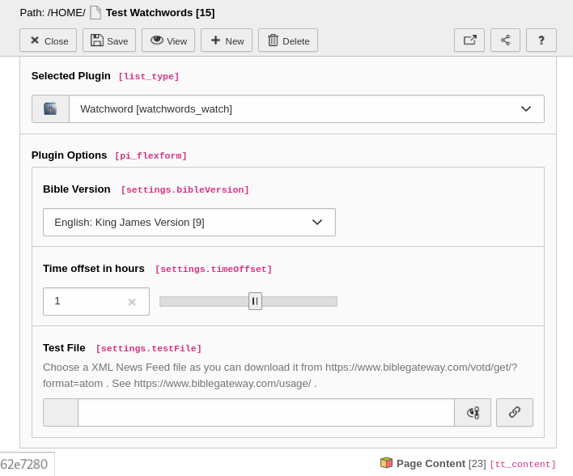

.. include:: ../Includes.txt

.. _for-editors:

===========
For Editors
===========

Insert a watchwords plugin on one or more pages.

Plugin Options
---------------

Bible Version
~~~~~~~~~~~~~~

Select from the list of available bible editions in multiple languages.

Time offset in hours
~~~~~~~~~~~~~~~~~~~~

Enter the number of hours for which your servers time is different to the server of the daily bible watchword.

Test file
~~~~~~~~~~

Enter the path and filename of a XML file in the news feed format.
This is used only for testing purposes or development.
The extension folder :file:`Resources/Public/Examples/` already has an example file.

:file:`Resources/Public/Examples/Verse_Feb_06_2022.xml`

 don't have administrative access to the installation.

.. tip::

   Use the HTML source of a bible server's news feed to generate your test file.

